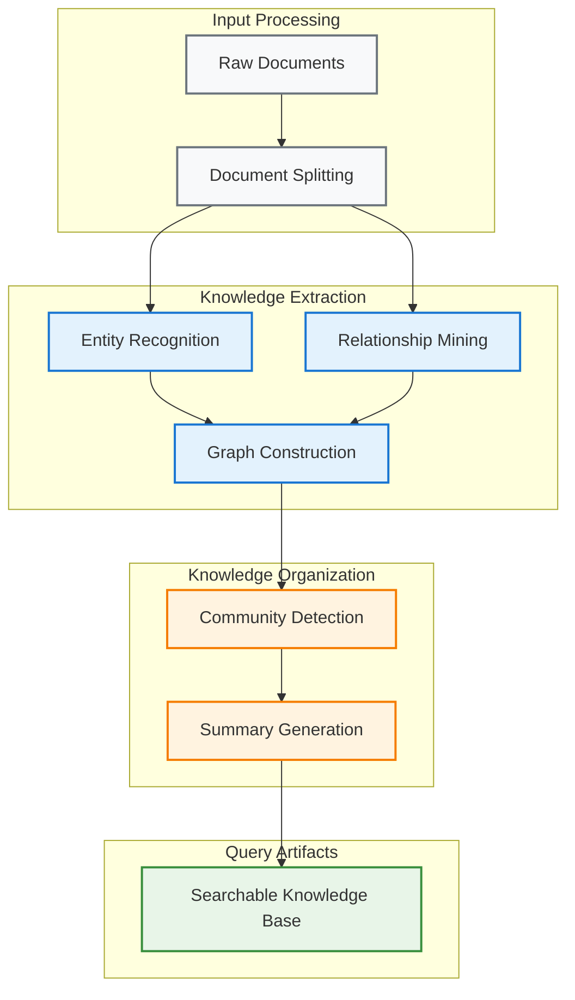
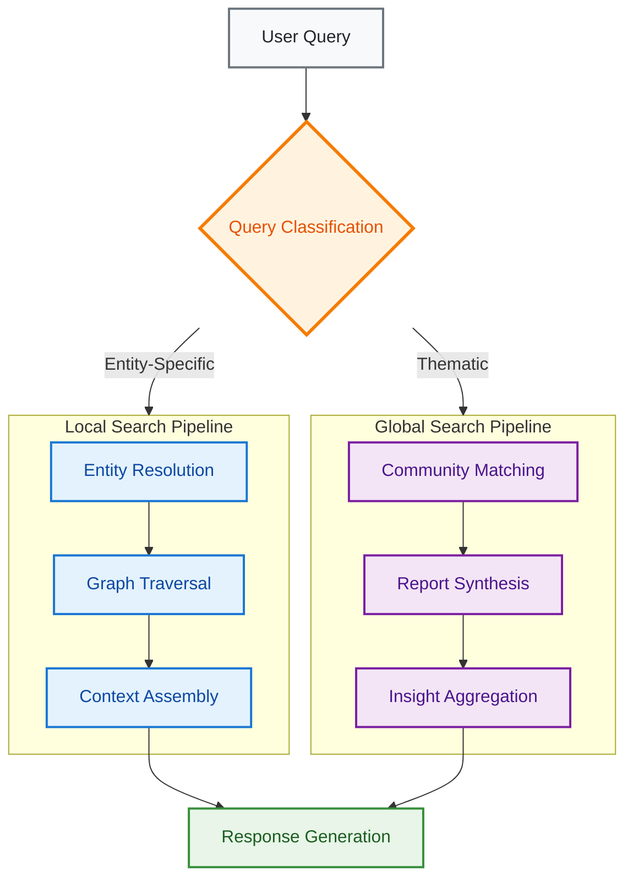

# GraphRAG Architecture Overview

GraphRAG processes document collections into structured knowledge graphs. The system supports both entity-specific queries and thematic analysis queries.

---

## Core System Overview

GraphRAG operates through **two fundamental processes**:

| Phase | Purpose | Output |
|-------|---------|--------|
| **Indexing Pipeline** | Analyzes documents to construct structured knowledge | Knowledge Graph + Community Reports |
| **Query Engine** | Uses knowledge graph for contextual responses | Contextual Answers |

## Indexing Pipeline Architecture

The indexing process turns raw documents into organized knowledge through a step-by-step process:

---

## Practical Example

> **Input Document**: "Ratan Tata served as Chairman of Tata Group from 1991 to 2012, transforming it into a global business group with acquisitions like Jaguar Land Rover."

### GraphRAG Knowledge Extraction

| Extract Type | Results |
|--------------|---------|
| **Entities** | Ratan Tata • Tata Group • Jaguar Land Rover • 1991 • 2012 |
| **Relationships** | Ratan Tata → served_as_chairman → Tata Group Tata Group → acquired → Jaguar Land Rover |
| **Communities** | Business Leadership • Automotive Industry |

---

## Query Engine Architecture

GraphRAG uses **two different search methods** to handle different types of questions:

### Local Search (Entity-Focused Queries)

| Aspect | Details |
|--------|---------|
| **Best For** | Specific factual questions about entities and relationships |
| **Examples** | "What companies did Ratan Tata lead?" • "When did Tata acquire Jaguar?" |
| **How it Works** | Finds entities → Follows connections → Builds context |
| **Characteristics** | High precision with specific responses |

### Global Search (Thematic Analysis)

| Aspect | Details |
|--------|---------|
| **Best For** | Big-picture questions requiring complete insights |
| **Examples** | "Key business transformation strategies?" • "Leadership patterns in business groups?" |
| **How it Works** | Community analysis → Pre-built summaries → Insight combining |
| **Characteristics** | Complete coverage with synthesized insights |

---

## Comparison with Traditional Search

| Aspect | Traditional Search | GraphRAG |
|-----------|------------------|----------|
| **Understanding** | Keyword matching only | Meaningful connections & relationships |
| **Analysis Depth** | Single-level results | **Detailed** (Local) + **Strategic** (Global) insights |
| **Source Tracking** | Basic page references | Complete traceability to original documents |
| **Context Awareness** | Isolated results | Connected knowledge with relationships |

---

## Knowledge Architecture Components

GraphRAG organizes information into **four interconnected layers**:

| Component | Description | Example |
|-----------|-------------|---------|
| **Entities** | People, organizations, and concepts | `Ratan Tata` • `Tata Group` • `Jaguar Land Rover` |
| **Relationships** | How different entities connect to each other | `Ratan Tata served as Chairman of Tata Group` |
| **Communities** | Groups of related entities by topic | `Business Leadership` • `Automotive Industry` |
| **Text Units** | Original text pieces with entity links | `"Ratan Tata served as Chairman of Tata Group from 1991..."` |

---

## Query Strategy Selection Guide

**Choose the right search method for your question type:**

| Query Example | Search Strategy | Why This Choice |
|---------------|-----------------|-----------------|
| `"What is Ratan Tata's background?"` | **Local Search** | Entity-specific biographical information |
| `"Which companies did Tata Group acquire?"` | **Local Search** | Specific relationship and timeline queries |
| `"What are the main business transformation patterns?"` | **Global Search** | Theme analysis across multiple entities |
| `"Analyze the strategic evolution of Indian business groups"` | **Global Search** | Complete pattern recognition and insights |

---

## Implementation Resources

| Resource | Description | Best For |
|----------|-------------|----------|
| **[Indexing Pipeline Guide](../guides/indexing_pipeline.md)** | Complete indexing process documentation | Understanding the build process |
| **[Query System Guide](../guides/query_system.md)** | Local vs Global search explained | Learning when to use each query type |
| **[System Customization Guide](../guides/customization.md)** | Component configuration and extensions | Adapting to your needs |

---

## Key Value Proposition

> **GraphRAG transforms how you work with documents** by building intelligent knowledge structures that understand context and relationships. This enables both **precise factual questions** and **strategic analytical insights** - going far beyond traditional search.

---

## Related Documentation

**[Indexing Pipeline](../guides/indexing_pipeline.md)**  
Technical implementation details and configuration options for building knowledge graphs.

**[Documentation Index](../index.md)**  
Return to documentation overview 