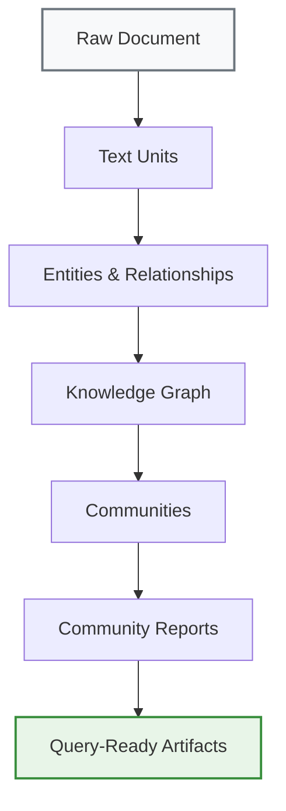
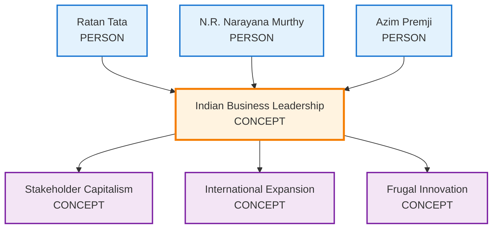

# Data Flow & Examples Guide

This guide shows document transformations through each step of the GraphRAG pipeline with real data examples.

---

## Pipeline Overview



This example traces a single document through the complete pipeline.

---

## Step 1: Raw Document Input

### Sample Input Document

**File: `business_leadership.txt`**
```
Indian Business Leadership Patterns

Successful Indian business leaders demonstrate unique characteristics that blend traditional values with modern business practices. Leaders like Ratan Tata, N.R. Narayana Murthy, and Azim Premji share common traits of long-term thinking and social responsibility.

These leaders prioritize stakeholder capitalism over shareholder primacy, investing heavily in employee development, community welfare, and sustainable business practices. Their approach to international expansion combines global ambitions with deep respect for local cultures and practices.

Innovation leadership in Indian companies often focuses on frugal innovation - creating high-quality solutions at affordable prices. This approach has enabled Indian companies to serve both domestic and international markets effectively.
```

**Document Properties:**
- **Length**: 847 characters
- **Word Count**: ~120 words  
- **Format**: Plain text
- **Content Type**: Business analysis

---

## Step 2: Text Unit Extraction

The document gets split into analyzable chunks with metadata.

### Generated Text Units

**Text Unit 1:**
```json
{
  "id": "text_unit_001",
  "document_id": "business_leadership.txt",
  "text_unit": "Indian Business Leadership Patterns\n\nSuccessful Indian business leaders demonstrate unique characteristics that blend traditional values with modern business practices. Leaders like Ratan Tata, N.R. Narayana Murthy, and Azim Premji share common traits of long-term thinking and social responsibility."
}
```

**Text Unit 2:**
```json
{
  "id": "text_unit_002", 
  "document_id": "business_leadership.txt",
  "text_unit": "These leaders prioritize stakeholder capitalism over shareholder primacy, investing heavily in employee development, community welfare, and sustainable business practices. Their approach to international expansion combines global ambitions with deep respect for local cultures and practices."
}
```

**Text Unit 3:**
```json
{
  "id": "text_unit_003",
  "document_id": "business_leadership.txt", 
  "text_unit": "Innovation leadership in Indian companies often focuses on frugal innovation - creating high-quality solutions at affordable prices. This approach has enabled Indian companies to serve both domestic and international markets effectively."
}
```

### Key Transformations
- **Single document** → **3 text units**
- **Maintains source traceability** via document reference
- **Preserves order** with chunk_order field
- **Adds metadata** for downstream processing

---

## Step 3: Entity Extraction

The LLM identifies people, organizations, and concepts from each text unit.

### Extracted Entities

**From Text Unit 1:**
```json
[
  {
    "id": "entity_001",
    "title": "Ratan Tata",
    "type": "PERSON", 
    "description": "Prominent Indian business leader known for long-term thinking and social responsibility",
    "text_unit_ids": ["text_unit_001"]
  },
  {
    "id": "entity_002", 
    "title": "N.R. Narayana Murthy",
    "type": "PERSON",
    "description": "Indian business leader demonstrating traditional values with modern practices",
    "text_unit_ids": ["text_unit_001"]
  },
  {
    "id": "entity_003",
    "title": "Azim Premji", 
    "type": "PERSON",
    "description": "Indian business leader sharing traits of long-term thinking and social responsibility",
    "text_unit_ids": ["text_unit_001"]
  },
  {
    "id": "entity_004",
    "title": "Indian Business Leadership",
    "type": "CONCEPT",
    "description": "Leadership approach blending traditional values with modern business practices",
    "text_unit_ids": ["text_unit_001"]
  }
]
```

**From Text Unit 2:**
```json
[
  {
    "id": "entity_005",
    "title": "Stakeholder Capitalism",
    "type": "CONCEPT", 
    "description": "Business approach prioritizing multiple stakeholders over shareholders only",
    "text_unit_ids": ["text_unit_002"]
  },
  {
    "id": "entity_006",
    "title": "International Expansion",
    "type": "CONCEPT",
    "description": "Global business growth strategy combining ambitions with cultural respect",
    "text_unit_ids": ["text_unit_002"]
  }
]
```

### Entity Summary
- **Total Entities**: 6
- **People**: 3 (Ratan Tata, N.R. Narayana Murthy, Azim Premji)
- **Concepts**: 3 (Leadership patterns, Stakeholder Capitalism, etc.)
- **Traceability**: Each entity links back to source text units

---

## Step 4: Relationship Extraction

The LLM identifies how entities connect to each other.

### Extracted Relationships

```json
[
  {
    "id": "rel_001",
    "source": "Ratan Tata",
    "target": "Indian Business Leadership", 
    "description": "Ratan Tata exemplifies Indian business leadership patterns",
    "rank": 24,
    "text_unit_ids": ["text_unit_001"]
  },
  {
    "id": "rel_002", 
    "source": "N.R. Narayana Murthy",
    "target": "Indian Business Leadership",
    "description": "N.R. Narayana Murthy demonstrates Indian business leadership characteristics",
    "rank": 22,
    "text_unit_ids": ["text_unit_001"]
  },
  {
    "id": "rel_003",
    "source": "Azim Premji", 
    "target": "Indian Business Leadership",
    "description": "Azim Premji shares common Indian business leadership traits", 
    "rank": 20,
    "text_unit_ids": ["text_unit_001"]
  },
  {
    "id": "rel_004",
    "source": "Indian Business Leadership",
    "target": "Stakeholder Capitalism",
    "description": "Indian business leaders prioritize stakeholder capitalism approach",
    "rank": 18, 
    "text_unit_ids": ["text_unit_002"]
  },
  {
    "id": "rel_005",
    "source": "Indian Business Leadership", 
    "target": "International Expansion",
    "description": "Indian leaders approach international expansion with cultural respect",
    "rank": 16,
    "text_unit_ids": ["text_unit_002"]
  }
]
```

### Relationship Patterns
- **Hub Entity**: "Indian Business Leadership" connects to most others
- **Rank Scores**: Indicate relationship importance (sum of source + target degrees)
- **Directional**: Source → Target relationships
- **Traceable**: Links back to source text units

---

## Step 5: Knowledge Graph Construction

Entities and relationships combine into a unified graph structure.

### Graph Representation



### Graph Statistics
- **Nodes**: 7 entities
- **Edges**: 6 relationships  
- **Connected Components**: 1 (fully connected)
- **Hub Nodes**: "Indian Business Leadership" (degree: 5)

---

## Step 6: Community Detection

The system groups related entities into communities using graph clustering.

### Detected Communities

**Community 1: Business Leadership**
```json
{
  "community_id": "community_001",
  "level": 0,
  "title": "Indian Business Leadership Community",
  "entities": [
    "Ratan Tata",
    "N.R. Narayana Murthy", 
    "Azim Premji",
    "Indian Business Leadership"
  ],
  "relationships": [
    "rel_001", "rel_002", "rel_003"
  ]
}
```

**Community 2: Business Practices** 
```json
{
  "community_id": "community_002",
  "level": 0, 
  "title": "Business Strategy and Practices",
  "entities": [
    "Stakeholder Capitalism",
    "International Expansion", 
    "Frugal Innovation"
  ],
  "relationships": [
    "rel_004", "rel_005", "rel_006"
  ]
}
```

### Community Analysis
- **2 communities** detected at level 0
- **Entity-based grouping**: Entities naturally cluster around thematic relationships
- **Logical grouping**: People vs Concepts naturally separated

---

## Step 7: Community Report Generation

Each community gets a comprehensive summary report.

### Generated Community Reports

**Community 1 Report:**
```markdown
# Indian Business Leadership Community

## Summary
This community centers around prominent Indian business leaders who have shaped modern business practices in India. The core figures - Ratan Tata, N.R. Narayana Murthy, and Azim Premji - represent a distinctive leadership philosophy that blends traditional Indian values with contemporary business strategies.

## Key Characteristics
- **Long-term Vision**: Focus on sustainable growth over short-term gains
- **Social Responsibility**: Integration of community welfare into business strategy  
- **Value Integration**: Blending traditional ethics with modern practices
- **Institutional Building**: Emphasis on creating lasting organizational capabilities

## Relationships
The leaders in this community are connected through shared leadership philosophies and approaches to business management, demonstrating consistent patterns across different industries and companies.

## Significance
This community represents the foundational leadership approach that has driven India's emergence as a global business power, influencing multiple generations of entrepreneurs and business leaders.
```

**Community 2 Report:**
```markdown
# Business Strategy and Practices

## Summary  
This community encompasses the core strategic approaches and methodologies employed by successful Indian businesses. It highlights distinctive practices that differentiate Indian business strategy from global norms.

## Key Practices
- **Stakeholder Capitalism**: Prioritizing multiple stakeholder groups rather than shareholder primacy
- **Cultural Sensitivity**: International expansion strategies that respect local cultures
- **Frugal Innovation**: Creating high-quality, affordable solutions for diverse markets
- **Sustainable Growth**: Long-term value creation over short-term profits

## Strategic Impact
These practices have enabled Indian companies to compete globally while maintaining strong domestic roots and social responsibility commitments.

## Market Applications
The strategies have proven effective across multiple sectors including technology, manufacturing, and services, providing a replicable framework for business growth.
```

---

## Step 8: Final Artifacts Generation

The system creates query-optimized data structures for both Local and Global search.

### Entity Artifacts (Local Search)

**Entity Record Example:**
```json
{
  "id": "entity_001",
  "title": "Ratan Tata", 
  "type": "PERSON",
  "description": "Prominent Indian business leader known for long-term thinking and social responsibility",
  "degree": 12,
  "communities": ["community_001"],
  "text_unit_ids": ["text_unit_001"]
}
```

### Relationship Artifacts (Local Search)

**Relationship Record Example:**
```json
{
  "id": "rel_001",
  "source": "Ratan Tata",
  "target": "Indian Business Leadership", 
  "description": "Ratan Tata exemplifies Indian business leadership patterns",
  "rank": 24,
  "text_unit_ids": ["text_unit_001"]
}
```

### Enhanced Text Units (Local Search)

**Enriched Text Unit:**
```json
{
  "id": "text_unit_001",
  "document_id": "business_leadership.txt",
  "text_unit": "Successful Indian business leaders demonstrate unique characteristics...",
  "entity_ids": ["entity_001", "entity_002", "entity_004"],
  "relationship_ids": ["rel_001", "rel_002"]
}
```

### Community Reports (Global Search)

**Query-Ready Community Report:**
```json
{
  "community_id": "community_001",
  "level": 0,
  "title": "Indian Business Leadership Community",
  "summary": "This community centers around prominent Indian business leaders...",
  "rating": 7.5,
  "rating_explanation": "High impact due to significant influence on business practices and economic development",
  "entities": ["entity_001", "entity_002", "entity_003", "entity_004"],
  "content": "# Indian Business Leadership Community\n\nThis community centers around prominent Indian business leaders..."
}
```

---

## Query Examples Using Generated Artifacts

### Local Search Query

**Query**: "What leadership characteristics does Ratan Tata demonstrate?"

**Data Retrieved**:
1. **Entity**: Ratan Tata record with attributes and connections
2. **Relationships**: All relationships involving Ratan Tata
3. **Text Units**: Original text mentioning Ratan Tata with entity annotations
4. **Connected Entities**: Indian Business Leadership, Stakeholder Capitalism

**Generated Response**: 
*"Ratan Tata demonstrates several key leadership characteristics including long-term thinking and social responsibility [Data: Entities (1), Relationships (1,4), Text Units (1)]. His leadership exemplifies Indian business leadership patterns that blend traditional values with modern business practices..."*

### Global Search Query

**Query**: "What are the patterns in Indian business leadership approaches?"

**Data Retrieved**:
1. **Community Reports**: Business Leadership Community summary
2. **Key Points**: Extracted strategic insights across the community
3. **Cross-Community Analysis**: Connections to Business Practices community

**Generated Response**:
*"Indian business leadership demonstrates several distinctive patterns [Data: Community Reports (1,2)]. Leaders consistently emphasize long-term value creation over short-term gains, integrate social responsibility into core business strategy, and blend traditional values with modern practices..."*

---

## Understanding Your Data

### Data Size Expectations

For a **typical business document collection**:

| Input | Typical Output Volume |
|-------|----------------------|
| **10 documents** (5-10 pages each) | 50-100 text units |
| **Text Units** | 150-300 entities |
| **Entities** | 200-400 relationships |
| **Communities** | 8-15 communities |
| **Reports** | 8-15 comprehensive summaries |

### Quality Indicators

**Good Entity Extraction**:
- Specific, well-defined entity names
- Accurate type classification (PERSON, ORGANIZATION, CONCEPT)
- Meaningful descriptions tied to source content

**Strong Relationships**:
- Clear, meaningful relationship descriptions
- High rank scores for important connections
- Logical directional relationships

**Coherent Communities**:
- Meaningful thematic groupings of related entities
- Logical groupings that make business sense
- Reasonable community sizes (3-12 entities)

### Debugging Your Pipeline

**Common Issues & Solutions**:

**Low Entity Count**: Increase chunk size or use more detailed documents
**Weak Relationships**: Ensure documents contain explicit connections between concepts
**Poor Communities**: Check if entities are well-connected; isolated entities won't cluster well
**Generic Descriptions**: Use domain-specific documents with detailed explanations

---

## Related Documentation

**[Documentation Index](../index.md)**  
Return to documentation overview

---

## Related Resources

- **[Architecture Overview](../architecture/overview.md)** - System design and concepts
- **[Indexing Pipeline](indexing_pipeline.md)** - Technical implementation
- **[Query System](query_system.md)** - Search strategies
- **[Advanced Examples](graph_extraction/index.md)** - Component-level customization 