# Indexing Pipeline Guide

The indexing pipeline processes documents through 7 sequential steps to build a knowledge representation for query operations.

---

## Pipeline Overview

The indexing process follows a **sequential architecture** where each step builds upon previous outputs:

```mermaid
flowchart TD
    A["📄 Input Documents"]
    
    subgraph Phase1[" "]
        direction TB
        P1["Phase 1: Text Processing"]
        B["Step 1: Text Units"]
        P1 --> B
    end
    
    subgraph Phase2[" "]
        direction TB
        P2["Phase 2: Knowledge Extraction"]
        C["Step 2: Knowledge Graph"]
        D["Step 3: Communities"]
        P2 --> C
        C --> D
    end
    
    subgraph Phase3[" "]
        direction TB
        P3["Phase 3: Artifact Generation"]
        E["Step 4: Reports"]
        F["Step 5: Entities"]
        G["Step 6: Relationships"]
        H["Step 7: Enhanced Text"]
        P3 --> E
        P3 --> F
        P3 --> G
        P3 --> H
    end
    
    I["🔍 Search Ready System"]
    
    A --> Phase1
    Phase1 --> Phase2
    Phase2 --> Phase3
    Phase3 --> I
    
    classDef phaseTitle fill:#f9f9f9,stroke:#333,stroke-width:2px,color:#000
    classDef stepBox fill:#e3f2fd,stroke:#1976d2,stroke-width:2px,color:#000
    classDef inputOutput fill:#fff3e0,stroke:#f57c00,stroke-width:2px,color:#000
    
    class P1,P2,P3 phaseTitle
    class B,C,D,E,F,G,H stepBox
    class A,I inputOutput
```



---

## Step 1: Text Unit Extraction

**Purpose**: Convert documents into manageable, analyzable text units

### What Happens
- Documents are loaded and their content extracted
- Text is split into overlapping chunks (typically 1000-1500 tokens)
- Each chunk gets a unique identifier and document reference

### Key Configuration
- **Chunk Size**: Configurable (example: 1200 tokens with 100 token overlap)
- **Splitting Strategy**: Depends on chosen TextSplitter implementation
- **Metadata Preservation**: Document source information maintained

### Input → Output
```
Raw Document: "50-page annual report.pdf"
    ↓
Text Units: 30+ chunks, each with:
   - Unique ID (uuid-001, uuid-002, ...)
   - Document ID reference
   - Text content (1-2 pages worth)
```

---

## Step 2: Graph Generation

**Purpose**: Extract knowledge from text units and build a unified knowledge graph

This step has **three sub-processes**:

### 2a. Entity & Relationship Extraction
- **Process**: LLM analyzes each text unit individually
- **Extraction**: Identifies people, organizations, concepts, and their relationships
- **Output**: Individual NetworkX graph per text unit

### 2b. Graph Merging
- **Process**: Combines all individual graphs into one master graph
- **Challenge**: Same entities mentioned across multiple text units need consolidation
- **Solution**: Creates lists of descriptions for each entity/relationship

### 2c. Description Summarization
- **Process**: LLM summarizes multiple descriptions into clean, unified descriptions
- **Result**: Generates a single, clear, and comprehensive description for each entity and relationship

### Input → Output
```
Text Unit: "Ratan Tata served as Chairman..."
    ↓ (Entity Extraction)
Individual Graph: [Ratan Tata] --[served_as_chairman]--> [Tata Group]
    ↓ (Graph Merging + Summarization)
Unified Graph: Clean entities and relationships with summarized descriptions
```

---

## Step 3: Community Detection

**Purpose**: Discover thematic clusters of related entities

### Algorithm
- **Method**: Hierarchical Leiden community detection
- **Input**: The unified knowledge graph from Step 2
- **Process**: Groups entities that are highly connected to each other
- **Levels**: Creates multi-level community hierarchy (Level 0, 1, 2...)

### Algorithm Capabilities
- **Automatic Topic Discovery**: Finds themes without manual categorization
- **Hierarchical Understanding**: Broad themes → Specific sub-topics
- **Scalability**: Works with graphs of any size

### Example Output
```
Community Structure:
   Level 0: "Business Leadership" (Ratan Tata, N.R. Narayana Murthy, ...)
   Level 1: "Technology Leaders" (subset of business leaders)
   Level 2: "Software Industry" (even more specific)
```

---

## Step 4: Community Reports

**Purpose**: Generate human-readable summaries for each community

### Process
- **Analysis**: LLM examines all entities and relationships within each community
- **Synthesis**: Creates comprehensive summaries explaining what the community represents
- **Insights**: Identifies key patterns, relationships, and notable findings

### Report Structure
Each community report contains:
- **Title**: Descriptive name for the community
- **Summary**: Overview of what this community represents
- **Rating**: Impact severity rating (float between 0-10)
- **Rating Explanation**: Single sentence explanation of the impact rating
- **Findings**: List of key insights with summaries and explanations
- **Content**: Full markdown-formatted report text

### Report Generation
- **Thematic Analysis**: Understand major themes in your data
- **Content Summaries**: High-level overviews of document collections
- **Pattern Recognition**: Discover trends across your document collection

---

## Step 5: Entity Artifacts

**Purpose**: Create searchable, structured entity records

### Process
- **Conversion**: Transforms graph nodes into structured data records
- **Enrichment**: Adds community membership and importance metrics
- **Vectorization**: Generates embeddings for semantic similarity search
- **Storage**: Stores in vector database for efficient retrieval

### Entity Record Structure
| Field | Description | Example |
|-------|-------------|---------|
| `title` | Display name | `"Ratan Tata"` |
| `id` | Unique identifier | `"uuid-entity-001"` |
| `type` | Entity category | `"PERSON"` |
| `description` | Summarized description | `"Former Chairman of Tata Group..."` |
| `degree` | Connection count | `3` (connected to 3 other entities) |
| `text_unit_ids` | Source references | `["uuid-text-001", "uuid-text-045", ...]` |
| `communities` | Community membership | `[1, 2]` (community IDs) |
| `graph_embedding` | Graph embedding vector | `null` (if not generated) |

---

## Step 6: Relationship Artifacts

**Purpose**: Create searchable, structured relationship records

### Process
- **Conversion**: Transforms graph edges into structured data records
- **Ranking**: Calculates relationship importance based on frequency and context
- **Traceability**: Maintains links to source text units
- **Organization**: Structures for efficient relationship queries

### Relationship Record Structure
| Field | Description | Example |
|-------|-------------|---------|
| `source` | Starting entity | `"Ratan Tata"` |
| `target` | Ending entity | `"Tata Group"` |
| `source_id` | Source entity ID | `"uuid-entity-001"` |
| `target_id` | Target entity ID | `"uuid-entity-004"` |
| `id` | Relationship ID | `"uuid-rel-001"` |
| `description` | Relationship summary | `"Served as Chairman from 1991-2012"` |
| `rank` | Importance score | `6` (sum of source and target degrees) |
| `text_unit_ids` | Source references | `["uuid-text-001", "uuid-text-003", ...]` |
| `source_degree` | Source entity degree | `3` |
| `target_degree` | Target entity degree | `3` |

---

## Step 7: Text Unit Artifacts (Enrichment)

**Purpose**: Link original text back to extracted knowledge

### Process
- **Enhancement**: Takes original text units from Step 1
- **Entity Linking**: Adds references to entities found in each text unit
- **Relationship Linking**: Adds references to relationships found in each text unit
- **Bidirectional Navigation**: Enables text ↔ graph navigation

### Enhanced Text Unit Structure
| Field | Description | Example |
|-------|-------------|---------|
| `id` | Original unit ID | `"uuid-text-unit-001"` |
| `document_id` | Source document | `"uuid-doc-001"` |
| `text_unit` | Original text content | `"Ratan Tata served as Chairman..."` |
| `entity_ids` | Referenced entities | `["uuid-entity-001", "uuid-entity-004"]` |
| `relationship_ids` | Referenced relationships | `["uuid-rel-001"]` |

### Why This Matters
- **Source Verification**: Trace any insight back to original text
- **Context Building**: Find all text mentioning specific entities
- **Query Enhancement**: Rich context for better answers

---

## Data Flow & Dependencies

```mermaid
flowchart LR
    subgraph Input[" "]
        direction TB
        I1["📄 Input"]
        A["Step 1<br/>Text Units"]
        I1 --> A
    end
    
    subgraph Processing[" "]
        direction TB
        P1["⚙️ Processing"]
        B["Step 2<br/>Knowledge Graph"]
        C["Step 3<br/>Communities"]
        P1 --> B
        B --> C
    end
    
    subgraph Output[" "]
        direction TB
        O1["📊 Output"]
        D["Step 4<br/>Reports"]
        E["Step 5<br/>Entities"]
        F["Step 6<br/>Relationships"]
        G["Step 7<br/>Enhanced Text"]
        O1 --> D
        O1 --> E
        O1 --> F
        O1 --> G
    end
    
    Input --> Processing
    Processing --> Output
    
    classDef sectionTitle fill:#f9f9f9,stroke:#333,stroke-width:2px,color:#000,font-weight:bold
    classDef component fill:#e3f2fd,stroke:#1976d2,stroke-width:1px,color:#000
    
    class I1,P1,O1 sectionTitle
    class A,B,C,D,E,F,G component
```



### Simple Dependencies

- **Steps 4, 5** need **Step 3** (Communities) to work
- **Steps 5, 6, 7** need **Step 2** (Knowledge Graph) to work  
- **Step 7** also needs **Step 1** (Text Units) to add references

---

## Customization Points

Each step can be customized for specific use cases:

| Step | Customization Options | Use Cases |
|------|----------------------|-----------|
| **Step 1** | Chunk size, overlap, splitting strategy | Domain-specific text formats |
| **Step 2** | LLM prompts, entity types, extraction rules | Specialized knowledge domains |
| **Step 3** | Community detection algorithm, resolution | Different clustering needs |
| **Step 4** | Report templates, analysis depth | Custom reporting requirements |
| **Step 5** | Vector embedding model, metadata fields | Specialized search needs |
| **Step 6** | Ranking algorithms, relationship types | Domain-specific relationships |
| **Step 7** | Enrichment strategies, linking rules | Custom text-graph connections |

---

## Related Documentation

**[Query System](query_system.md)**  
Documentation for searching knowledge graphs with Local vs Global search strategies.

**[Documentation Index](../index.md)**  
Return to documentation overview

---

## Related Resources

- **[Architecture Overview](../architecture/overview.md)** - System design and concepts
- **[Data Flow Examples](data_flow_examples.md)** - Real data transformations
- **[Advanced Examples](graph_extraction/index.md)** - Component-level customization

The indexing pipeline creates the foundation for intelligent querying. Each step contributes to building a comprehensive knowledge representation that enables both precise factual queries and strategic analytical insights. 