# Query System Guide

GraphRAG provides two search approaches for querying indexed knowledge graphs. Each approach is designed to handle a different category of question.

---

## Overview: Two Query Types

GraphRAG provides two distinct search modes to handle different types of questions:

```mermaid
flowchart LR
    question["🔍 Your Question"] --> decision["What type of answer?"]
    
    decision --> local["🎯 Local Search<br/>Specific Facts"]
    decision --> global["🌍 Global Search<br/>Broad Themes"]
    
    local --> localout["Detailed entity info<br/>Precise relationships<br/>Source references"]
    global --> globalout["Thematic analysis<br/>Pattern analysis<br/>Content synthesis"]
```



---

## Local Search: Specific Entity Questions

**Purpose**: Answer detailed questions about specific people, organizations, or concepts

### How It Works

Local Search finds and analyzes entities and relationships that are most relevant to your question, then provides detailed answers with source references.


### Question Types

| Question Type | Example | Why Local Search |
|---------------|---------|------------------|
| **Specific People** | "What role did Ratan Tata play in Tata Group?" | Finds entity-specific information |
| **Relationships** | "How are Tata Consultancy Services and Tata Group connected?" | Retrieves relationship details |
| **Company Details** | "What businesses does Reliance Industries operate?" | Gathers entity-focused facts |
| **Event Details** | "What happened during the 2008 Mumbai attacks?" | Finds specific event information |

### Example Queries

**Local Search Questions:**
- "Who is the CEO of Tata Consultancy Services?"
- "What products does Infosys offer?"
- "How is Wipro related to the IT industry?"
- "What awards has A.P.J. Abdul Kalam received?"

**Local Search Response Format:**
- Detailed factual answers
- Source references to original documents
- Specific entity and relationship information
- Precise, targeted responses

---

## Global Search: Thematic Analysis Questions

**Purpose**: Analyze broad themes and patterns across your entire knowledge base

### How It Works

Global Search analyzes community reports (thematic clusters) to identify key patterns and synthesize insights across the entire knowledge graph.


### Question Types

| Question Type | Example | Why Global Search |
|---------------|---------|------------------|
| **Strategic Themes** | "What are the main challenges facing Indian technology companies?" | Analyzes patterns across communities |
| **Industry Trends** | "How has the Indian business landscape evolved?" | Synthesizes broad insights |
| **Comparative Analysis** | "What are the different leadership styles in major Indian corporations?" | Compares across multiple entities |
| **Impact Assessment** | "What has been the impact of digital transformation in India?" | Evaluates system-wide effects |

### Example Queries

**Global Search Questions:**
- "What are the major trends in Indian business leadership?"
- "How do technology companies in India approach innovation?"
- "What are the common challenges facing Indian startups?"
- "What patterns emerge from successful Indian entrepreneurs?"

**Global Search Response Format:**
- Comprehensive thematic analysis
- Thematic analysis and patterns
- Synthesized information from multiple sources
- Broader perspective on topics

---

## Search Type Selection

**Use Local Search for:**

| Your Question Contains | Examples |
|----------------------|----------|
| **Specific entity names** | "What does TechCorp do?" "Who is Alice Smith?" |
| **Direct relationships** | "How are CompanyA and CompanyB connected?" |
| **Factual details** | "When did this event happen?" "What are the specifications?" |
| **Entity attributes** | "What products does this company make?" |

**Use Global Search for:**

| Your Question Asks About | Examples |
|--------------------------|----------|
| **Patterns across data** | "What trends appear in the technology sector?" |
| **Themes and topics** | "What are the main challenges discussed?" |
| **Comparative analysis** | "How do different approaches compare?" |
| **System-wide insights** | "What patterns emerge across all documents?" |

---

## Implementation Approach

### Local Search Setup

For precise, entity-focused questions about specific people, companies, or relationships:

```python
from langchain_graphrag.query.local_search import LocalSearch, LocalSearchPromptBuilder, LocalSearchRetriever

# Configure with your LLM and indexed artifacts
local_search = LocalSearch(
    llm=your_llm,
    prompt_builder=LocalSearchPromptBuilder(),
    retriever=LocalSearchRetriever(
        context_selector=your_context_selector,
        context_builder=your_context_builder,
        artifacts=your_artifacts
    )
)

# Get the search chain and ask specific questions
search_chain = local_search()
response = search_chain.invoke("What role did Ratan Tata play in Tata Group?")
```

**Sample Response:**
> Ratan Tata served as Chairman of Tata Group from 1991 to 2012, leading major international acquisitions including Jaguar Land Rover and Corus Steel [Data: Entities (12, 45), Relationships (156)]. He transformed the group into a global conglomerate operating in over 100 countries.

### Global Search Setup

For thematic analysis across your entire knowledge base:

```python
from langchain_graphrag.query.global_search import GlobalSearch

# Configure with community analysis components
global_search = GlobalSearch(
    kp_generator=your_kp_generator,
    kp_aggregator=your_kp_aggregator
)

# Ask thematic questions
response = global_search.invoke("What are the leadership patterns in Indian business?")
```

**Sample Response:**
> ## Leadership Patterns in Indian Business
> 
> **Visionary Innovation with Social Responsibility**: Leaders like Ratan Tata and N.R. Narayana Murthy combine aggressive expansion with strong social consciousness [Data: Reports (12, 34, 67)].
> 
> **Long-term Relationship Focus**: Emphasis on multi-generational partnerships over short-term profits [Data: Reports (23, 45, 89)].

---

## Best Practices

### Optimal Query Design

**Local Search Characteristics:**
- Specific entity names and timeframes
- Direct relationships between known entities
- Factual details and historical information
- "Who," "what," "when," and "where" questions

**Global Search Characteristics:**
- Questions without specific entity names mentioned
- Asking about "trends," "patterns," "themes," or "strategies" 
- Comparing multiple companies/sectors without naming them
- "What are the trends in...", "How do companies approach...", "What patterns emerge..." questions

### Query Quality Guidelines

| Factor | Local Search | Global Search |
|--------|-------------|---------------|
| **Scope** | Narrow, specific | Broad, thematic |
| **Entities** | Named entities preferred | Entity-agnostic |
| **Timeframe** | Specific periods | Trend analysis |
| **Response** | Factual details | Thematic analysis |


## Related Documentation

**[Data Flow Examples](data_flow_examples.md)**  
Ready to see real data transformations? 

**[Documentation Index](../index.md)**  
Return to documentation overview

---

## Related Resources

- **[Architecture Overview](../architecture/overview.md)** - System design and concepts
- **[Indexing Pipeline](indexing_pipeline.md)** - Technical implementation
- **[Advanced Examples](graph_extraction/index.md)** - Component customization

You now understand the core GraphRAG concepts and implementation.
The query system transforms your indexed knowledge into actionable insights through both precise fact-finding and strategic analysis capabilities. 